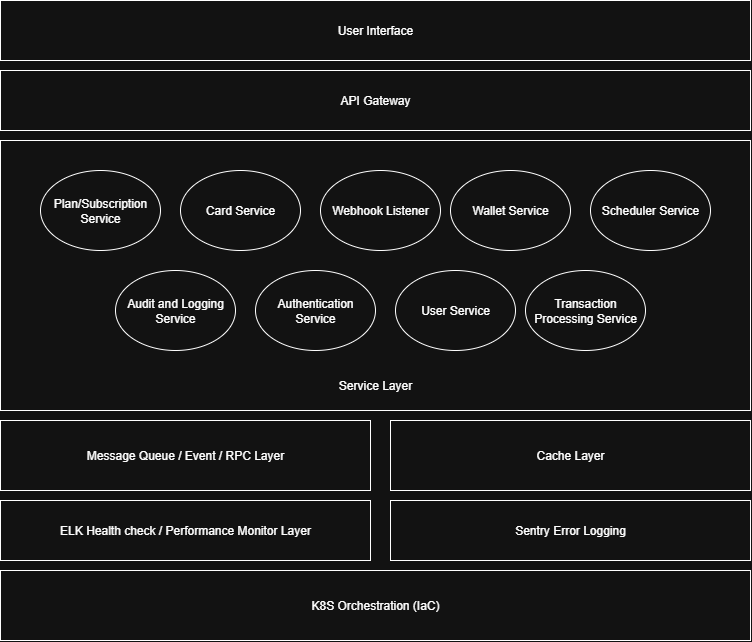

# Assessment Project


## Project Description

A modular, scalable wallet and card management API built with NestJS, TypeORM, and PostgreSQL. It supports company plans, card usage limits, transactions, and webhooks, with caching via Redis. Designed for extensibility and production readiness.

## Table of Contents

- [Diagrams](#diagrams)
- [Installation](#installation)
- [Usage](#usage)
- [Features](#features)
- [Endpoints](#endpoints)
- [License](#license)

## Diagrams

### Entity-Relation Diagram


### Transaction Sequence Diagram


### Components (Ideal Architecture)



| Component                                | Description                                                        |
| ---------------------------------------- | ------------------------------------------------------------------ |
| **API Gateway**                          | Entry point for webhooks and internal/external API requests.       |
| **Authentication/Authorization Service** | Handles API keys, roles, and permissions.                          |
| **Transaction Processing Service**       | Core business logic for validation and balance updates.            |
| **Wallet Service**                       | Manages balance, ledger entries, caching, and reconciliation.      |
| **Card Service**                         | Handles card data, limits, and usage counters.                     |
| **Plan/Subscription Service**            | Stores and enforces company plan constraints.                      |
| **Webhook Listener**                     | Processes external requests, queues jobs, and ensures idempotency. |
| **Scheduler Service**                    | Resets counters daily/monthly and handles periodic tasks.          |
| **Audit and Logging Service**            | Centralized logging and event tracking for observability.          |

## Installation

### Prerequisites

- [Docker](https://www.docker.com/)
- [Docker Compose](https://docs.docker.com/compose/)
- [Node.js](https://nodejs.org/) (v18+ if running locally)

### Environment Variables

Create a `.env` file in the project root with:

```env
DATABASE_HOST=postgres
DATABASE_PORT=5432
DATABASE_USER=admin
DATABASE_PASSWORD=admin
DATABASE_NAME=assessment
ENVIRONMENT=dev
REDIS_URL=redis://redis:6379
```

### Using Docker Compose

```bash
docker-compose up --build
```

- API: http://localhost:3000
- Swagger Docs: http://localhost:3000/docs
- PostgreSQL: localhost:5454
- Redis: localhost:6380
- PgAdmin: http://localhost:15454

### Local Development

```bash
npm install
npm run start:dev
```

## Usage

- Access the API at `http://localhost:3000`
- Interactive API docs at `http://localhost:3000/docs`
- Use PgAdmin for DB management (`admin@mail.com` / `admin`)

## Features

- Company, Plan, Card, Transaction, and Card Usage management
- Daily and monthly card usage limits per plan
- Transaction validation and balance caching (Redis)
- Webhook endpoint for external station transactions
- Modular NestJS architecture
- TypeORM for database models
- Swagger API documentation

## Endpoints

### Admin Endpoints

- `POST /admin/company` - Create company
- `GET /admin/company/:id` - Get company by ID
- `GET /admin/company` - List companies (pagination)
- `PUT /admin/company/:id` - Update company
- `DELETE /admin/company/:id` - Delete company

- `POST /admin/plan` - Create plan
- `GET /admin/plan/:id` - Get plan by ID
- `GET /admin/plan` - List plans (pagination)
- `PUT /admin/plan/:id` - Update plan
- `DELETE /admin/plan/:id` - Delete plan

- `POST /admin/card` - Create card
- `GET /admin/card/:id` - Get card by ID
- `GET /admin/card` - List cards (pagination)
- `PUT /admin/card/:id` - Update card
- `DELETE /admin/card/:id` - Delete card

- `POST /admin/card-usage` - Create card usage record
- `GET /admin/card-usage/:id` - Get card usage by ID
- `GET /admin/card-usage` - List card usages (pagination)
- `PUT /admin/card-usage/:id` - Update card usage
- `DELETE /admin/card-usage/:id` - Delete card usage

- `POST /admin/transaction` - Create transaction
- `GET /admin/transaction/:id` - Get transaction by ID
- `GET /admin/transaction` - List transactions (pagination)
- `PUT /admin/transaction/:id` - Update transaction
- `DELETE /admin/transaction/:id` - Delete transaction
- `GET /admin/transaction/balance/:companyId` - Get company balance

### Webhook Endpoints

- `POST /webhook/station-transaction` - Submit station transaction (validates card usage and company balance)
