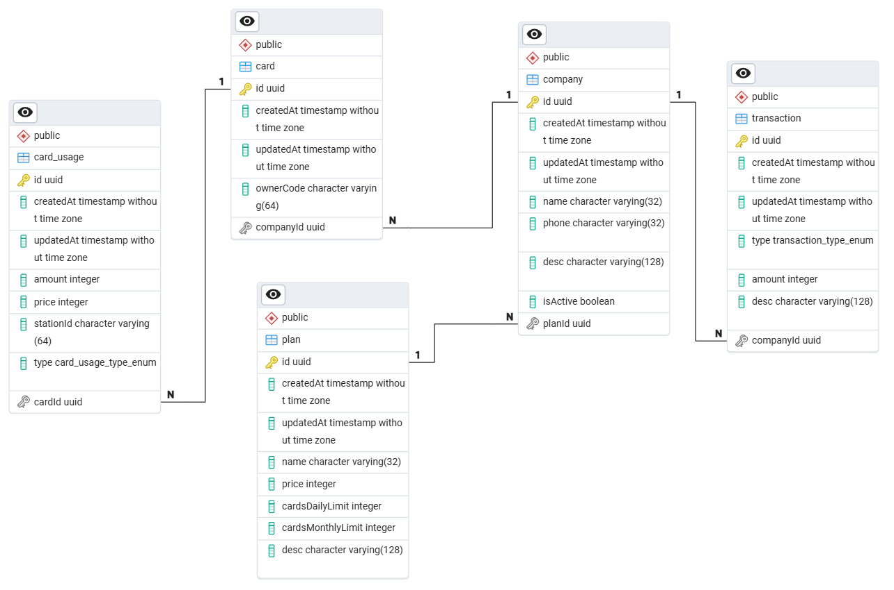

# Assessment project

## Diagrams

### Entitiy-relation diagram (Current implementation)

### Transaction diagram (Current implementation)

### Components (Ideal architecture)

| Component                                | Description                                                        |
| ---------------------------------------- | ------------------------------------------------------------------ |
| **API Gateway**                          | Entry point for webhooks and internal/external API requests.       |
| **Authentication/Authorization Service** | Handles API keys, roles, and permissions.                          |
| **Transaction Processing Service**       | Core business logic for validation and balance updates.            |
| **Wallet Service**                       | Manages balance, ledger entries, caching, and reconciliation.      |
| **Card Service**                         | Handles card data, limits, and usage counters.                     |
| **Plan/Subscription Service**            | Stores and enforces company plan constraints.                      |
| **Webhook Listener**                     | Processes external requests, queues jobs, and ensures idempotency. |
| **Scheduler Service**                    | Resets counters daily/monthly and handles periodic tasks.          |
| **Audit and Logging Service**            | Centralized logging and event tracking for observability.          |
